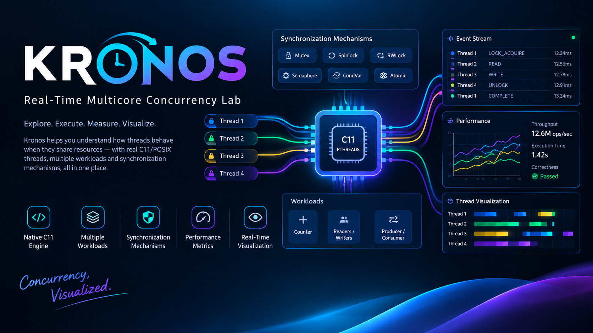

# KRONOS

## Real-Time Multicore Concurrency Lab

Kronos is a **native C11/POSIX multithreading experimentation platform** for studying how concurrent threads behave when multiple threads access shared state under different synchronization mechanisms.

Instead of only implementing synchronization primitives and printing a final result, Kronos provides a complete experimentation pipeline:

```text
Configure Experiment
        ↓
Launch Native C Engine
        ↓
Create Real pthread Threads
        ↓
Execute Concurrent Workload
        ↓
Apply Synchronization
        ↓
Record Execution Events
        ↓
Measure Performance
        ↓
Verify Correctness
        ↓
Stream Live Events
        ↓
Visualize Thread Behavior
```

> **Execute concurrency → Instrument execution → Measure performance → Visualize behavior**

---
## Watch Demo

### 🎥 Click Here to Watch the Project Demo

[](https://drive.google.com/file/d/1kUuXqIMwRQX3OdJ-xxn_6wvKy5EbkEHD/view?usp=sharing)

**▶️ [Click here to watch the full Kronos project demo](https://drive.google.com/file/d/1kUuXqIMwRQX3OdJ-xxn_6wvKy5EbkEHD/view?usp=sharing)**


---

## Table of Contents

* [Overview](#overview)
* [What Kronos Does](#what-kronos-does)
* [Core Architecture](#core-architecture)
* [Supported Workloads](#supported-workloads)

  * [1. Shared Counter](#1-shared-counter)
  * [2. Readers / Writers](#2-readers--writers)
  * [3. Producer / Consumer](#3-producer--consumer)
* [Synchronization Mechanisms](#synchronization-mechanisms)
* [Synchronization Layer](#synchronization-layer)
* [Thread Execution Model](#thread-execution-model)
* [Experiment Runner](#experiment-runner)
* [Execution Instrumentation](#execution-instrumentation)
* [Event Recording](#event-recording)
* [Live Event Streaming](#live-event-streaming)
* [Next.js API Layer](#nextjs-api-layer)
* [Non-Live Execution](#non-live-execution)
* [Live Execution](#live-execution)
* [Performance Measurement](#performance-measurement)
* [Timing](#timing)
* [Throughput](#throughput)
* [Correctness Verification](#correctness-verification)
* [Thread Visualization](#thread-visualization)
* [Event Stream Visualization](#event-stream-visualization)
* [Control Room](#control-room)
* [Project Structure](#project-structure)
* [Layer Responsibilities](#layer-responsibilities)
* [Technology Stack](#technology-stack)
* [Development Environment](#development-environment)
* [Why C?](#why-c)
* [Why a Web Interface?](#why-a-web-interface)
* [Example Experiment](#example-experiment)
* [Example Execution Trace](#example-execution-trace)
* [Design Philosophy](#design-philosophy)
* [What Kronos Demonstrates](#what-kronos-demonstrates)
* [Project Objective](#project-objective)
* [In One Sentence](#in-one-sentence)

---

# Overview

Modern multicore systems execute many threads concurrently. Once multiple threads access shared state, synchronization becomes necessary to control access and maintain correctness.

Kronos provides a controlled environment where these concurrency concepts can be **executed on real native threads**, measured, instrumented, and visualized.

The project combines:

```text
C11
 +
POSIX Threads
 +
Synchronization
 +
Shared State
 +
Runtime Instrumentation
 +
Performance Measurement
 +
Next.js Visualization
```

The native C engine performs the actual concurrent execution.

The Next.js application acts as the control and visualization layer.

The result is a small **multicore concurrency laboratory** where different workloads can be executed with different synchronization mechanisms and their runtime behavior can be observed.

---

# What Kronos Does

Kronos allows a user to configure a concurrent experiment from the web interface.

A configuration can contain parameters such as:

```text
Workload
Synchronization Mechanism
Thread Count
Operations / Thread
Reader Count
Writer Count
Producer Count
Consumer Count
Queue Capacity
```

The frontend sends this configuration to the Next.js API.

The API validates the request, constructs the arguments required by the native executable, and launches the Kronos C engine.

The native engine then:

1. Selects the requested workload.
2. Initializes the workload state.
3. Initializes the selected synchronization mechanism.
4. Initializes event instrumentation.
5. Creates native POSIX threads.
6. Assigns the appropriate role to each thread.
7. Executes the workload concurrently.
8. Records execution and synchronization events.
9. Measures execution time.
10. Waits for all threads to finish.
11. Calculates the expected result.
12. Obtains the actual result.
13. Calculates performance metrics.
14. Cleans up resources.
15. Returns the experiment result.

For live execution, events generated by the native engine are streamed through the Next.js API to the browser using **Server-Sent Events (SSE)**.

The browser therefore observes **real native C execution**, rather than simulating concurrency in JavaScript.

---

# Core Architecture

```text
┌─────────────────────────────────────────────────────┐
│                   NEXT.JS FRONTEND                  │
│                                                     │
│  Experiment Configuration                           │
│  Execution Control Room                             │
│  Thread Timeline                                    │
│  Event Stream                                       │
│  Queue Visualization                                │
│  Performance Metrics                                │
└─────────────────────────┬───────────────────────────┘
                          │
                          │ HTTP / SSE
                          ▼
┌─────────────────────────────────────────────────────┐
│                    NEXT.JS API                      │
│                                                     │
│  Request Validation                                 │
│  Native Argument Construction                       │
│  Native Process Launch                              │
│  Event Parsing                                      │
│  SSE Streaming                                      │
│  Result Handling                                    │
└─────────────────────────┬───────────────────────────┘
                          │
                          │ Native Process
                          ▼
┌─────────────────────────────────────────────────────┐
│                 KRONOS C ENGINE                     │
│                                                     │
│  Experiment Runner                                  │
│  Thread Management                                  │
│  Workload Selection                                 │
│  Synchronization Layer                              │
│  Event Instrumentation                              │
│  Metrics                                            │
└────────────────────┬───────────────────┬────────────┘
                     │                   │
                     ▼                   ▼
          ┌────────────────────┐  ┌──────────────────────┐
          │      WORKLOADS     │  │   SYNCHRONIZATION    │
          │                    │  │                      │
          │ Shared Counter     │  │ None                 │
          │ Readers / Writers  │  │ Mutex                │
          │ Producer / Consumer│  │ Spinlock             │
          │                    │  │ RWLock               │
          └────────────────────┘  │ Semaphore            │
                                  │ Condition Variable   │
                                  │ Atomic               │
                                  └──────────────────────┘
```

The important separation is:

```text
Frontend
    ↓
Control + Visualization

Next.js API
    ↓
Process Bridge

C Engine
    ↓
Actual Concurrent Execution
```

---

# Supported Workloads

Kronos currently provides three primary concurrency workloads:

```text
1. Shared Counter
2. Readers / Writers
3. Producer / Consumer
```

Each workload can be executed under different synchronization strategies.

---

# 1. Shared Counter

The shared-counter workload creates multiple worker threads that repeatedly update a shared counter.

Conceptually:

```text
               Shared Counter
                    ↑
         ┌──────────┼───────────┐
         │          │           │
      Thread 1   Thread 2    Thread N
         │          │           │
         └────── Concurrent ────┘
                  Updates
```

For example:

```text
Threads = 4
Operations / Thread = 1,000,000
```

Each worker performs one million increments.

The expected result is therefore:

```text
4 × 1,000,000 = 4,000,000
```

The experiment can be executed using different synchronization mechanisms:

```text
COUNTER + NONE
COUNTER + MUTEX
COUNTER + SPINLOCK
COUNTER + RWLOCK
COUNTER + SEMAPHORE
COUNTER + CONDVAR
COUNTER + ATOMIC
```

After execution, Kronos compares the expected counter value against the actual shared counter.

This provides both:

* A correctness check
* A performance measurement

---

# 2. Readers / Writers

The readers/writers workload contains two categories of threads:

```text
                  Shared Data
                       ↑
                 ┌─────┴─────┐
                 │           │
              Readers      Writers
                 │           │
             Read State   Modify State
```

Readers perform read operations on shared data.

Writers modify the shared state and require exclusive access.

The experiment can configure:

* Total thread count
* Number of readers
* Number of writers
* Operations per thread
* Synchronization mechanism

The synchronization layer provides separate read-lock operations where supported.

During execution, Kronos records relevant thread and synchronization events.

This allows the execution of concurrent readers and writers to be observed rather than treating the workload as a simple final-result benchmark.

---

# 3. Producer / Consumer

The producer/consumer workload contains producer and consumer threads operating on a bounded queue.

```text
               PRODUCERS
              ┌────┬────┐
              │    │    │
              ▼    ▼    ▼
         ┌─────────────────┐
         │  BOUNDED QUEUE  │
         └─────────────────┘
              │    │
              ▼    ▼
            CONSUMERS
```

Producers insert work into the queue.

Consumers remove work from the queue.

Because the queue has limited capacity, synchronization is required when the queue becomes full or empty.

For example:

```text
Queue Full
    ↓
Producer waits
    ↓
Consumer removes item
    ↓
Producer continues
```

Or:

```text
Queue Empty
    ↓
Consumer waits
    ↓
Producer inserts item
    ↓
Consumer continues
```

The workload therefore demonstrates coordination between threads through waiting and signalling.

Kronos records events such as:

```text
QUEUE_PUSH
QUEUE_POP
COND_WAIT
COND_SIGNAL
```

This makes producer/consumer coordination visible in the execution trace.

---

# Synchronization Mechanisms

Kronos currently supports:

| Mechanism          | Identifier  | Purpose                         |
| ------------------ | ----------- | ------------------------------- |
| No synchronization | `NONE`      | Unprotected shared access       |
| Mutex              | `MUTEX`     | Mutual exclusion                |
| Spinlock           | `SPINLOCK`  | Busy-wait based locking         |
| Read-Write Lock    | `RWLOCK`    | Separate read/write access      |
| Semaphore          | `SEMAPHORE` | Semaphore-based synchronization |
| Condition Variable | `CONDVAR`   | Waiting and signalling          |
| Atomic Operations  | `ATOMIC`    | C11 atomic operations           |

The same workload can therefore be executed using different synchronization strategies.

For example:

```text
Shared Counter
      │
      ├── Mutex
      ├── Spinlock
      ├── Semaphore
      ├── Atomic
      └── ...
```

This separation makes it possible to study the effect of synchronization without rewriting the entire workload.

---

# Synchronization Layer

The synchronization layer provides a common interface used by the workloads.

It is responsible for:

* Initialization
* Destruction
* Lock acquisition
* Lock release
* Read locking
* Read unlocking
* Condition-variable waiting
* Condition-variable signalling
* Atomic increments
* Atomic loads
* Synchronization event instrumentation

The selected Kronos synchronization type maps to a native synchronization primitive.

### Mutex

```text
SYNC_MUTEX
    ↓
pthread_mutex_t
```

### Spinlock

```text
SYNC_SPINLOCK
    ↓
atomic_flag
```

### Read-Write Lock

```text
SYNC_RWLOCK
    ↓
pthread_rwlock_t
```

### Semaphore

```text
SYNC_SEMAPHORE
    ↓
sem_t
```

### Condition Variable

```text
SYNC_CONDVAR
    ↓
pthread_mutex_t
+
condition variables
```

### Atomic

```text
SYNC_ATOMIC
    ↓
C11 atomic operations
```

The workload therefore interacts with a common abstraction:

```text
Workload
   ↓
Synchronization Interface
   ↓
Selected Native Primitive
```

This keeps workload logic and synchronization implementation separated.

---

# Thread Execution Model

Kronos uses **POSIX threads (`pthread`)** for actual concurrent execution.

Depending on the workload, different thread roles are created.

## Counter

```text
Worker 1
Worker 2
Worker 3
...
Worker N
```

## Readers / Writers

```text
Reader 1
Reader 2
...
Reader R

Writer 1
Writer 2
...
Writer W
```

## Producer / Consumer

```text
Producer 1
Producer 2
...
Producer P

Consumer 1
Consumer 2
...
Consumer C
```

The experiment configuration determines the number of threads and their roles.

The experiment runner creates the threads, passes the required execution context, and waits for their completion using `pthread_join()`.

---

# Experiment Runner

The experiment runner coordinates the complete native experiment lifecycle.

The lifecycle is:

```text
Receive Configuration
        ↓
Select Workload
        ↓
Initialize Workload
        ↓
Initialize Synchronization
        ↓
Initialize Event Buffer
        ↓
Create Worker Threads
        ↓
Execute Concurrent Workload
        ↓
Record Runtime Events
        ↓
Join Worker Threads
        ↓
Calculate Metrics
        ↓
Calculate Expected Result
        ↓
Read Actual Result
        ↓
Cleanup
        ↓
Return Result
```

The experiment runner is responsible for connecting all the native components together.

It does not itself define the business logic of every workload.

Instead, it selects the workload and provides it with the appropriate synchronization and execution context.

---

# Execution Instrumentation

Kronos does not treat the native experiment as a black box.

The engine records important events while the threads are executing.

Examples include:

```text
THREAD_START
THREAD_END

LOCK_WAIT
LOCK_ACQUIRE
LOCK_RELEASE

READ_LOCK_WAIT
READ_LOCK_ACQUIRE
READ_LOCK_RELEASE

COND_WAIT
COND_SIGNAL

QUEUE_PUSH
QUEUE_POP

COUNTER_INCREMENT
```

These events form an execution trace.

A simplified execution could look like:

```text
Thread 1 → THREAD_START
Thread 2 → THREAD_START

Thread 1 → LOCK_ACQUIRE
Thread 2 → LOCK_WAIT

Thread 1 → COUNTER_INCREMENT
Thread 1 → LOCK_RELEASE

Thread 2 → LOCK_ACQUIRE
Thread 2 → COUNTER_INCREMENT
Thread 2 → LOCK_RELEASE

Thread 1 → THREAD_END
Thread 2 → THREAD_END
```

Instead of seeing only the final execution time, Kronos can expose what happened during execution.

---

# Event Recording

Kronos maintains an event buffer for runtime instrumentation.

When an operation of interest occurs, an event can be recorded with information about the execution.

Conceptually:

```text
Thread Operation
       ↓
Event Generated
       ↓
Event Recorded
       ↓
Event Available to Runtime
```

For live execution, these events can also be emitted as structured JSON.

The native runtime flushes live event output so that the API can process events while the experiment is still running.

---

# Live Event Streaming

One of Kronos's important features is the connection between native execution and real-time visualization.

The native C engine generates execution events.

The Next.js API receives those events and forwards them to the browser using **Server-Sent Events (SSE)**.

```text
┌─────────────────────┐
│   Native C Engine   │
│                     │
│ pthread execution   │
│ event generation    │
└──────────┬──────────┘
           │
           │ JSON Events
           ▼
┌─────────────────────┐
│     Next.js API     │
│                     │
│ Process Management  │
│ Event Parsing       │
└──────────┬──────────┘
           │
           │ SSE
           ▼
┌─────────────────────┐
│       Browser       │
│                     │
│  Live Control Room  │
└─────────────────────┘
```

This means the browser does not need to wait for the entire native experiment to finish before receiving execution information.

---

# Next.js API Layer

The Next.js API is the bridge between the browser and the native C executable.

Its responsibilities include:

* Receiving experiment requests
* Validating configuration
* Building native command-line arguments
* Launching the native `kronos` executable
* Handling native process output
* Parsing live event data
* Forwarding live events
* Returning the final experiment result

The frontend therefore communicates with the native runtime through the API layer:

```text
Browser
   ↓
Next.js API
   ↓
Native Kronos Executable
```

This keeps the frontend and native execution layers separated.

---

# Non-Live Execution

For a normal experiment, the API launches the native executable and waits for completion.

The flow is:

```text
Frontend
   ↓
POST Experiment Request
   ↓
Next.js API
   ↓
Validate Configuration
   ↓
Build Native Arguments
   ↓
Launch kronos
   ↓
Wait for Completion
   ↓
Read Native Result
   ↓
Return JSON Response
   ↓
Frontend
```

The frontend then displays the completed experiment result.

---

# Live Execution

For live execution, the flow is:

```text
Frontend
   ↓
Start Experiment
   ↓
Next.js API
   ↓
Launch Native Engine
   ↓
Native Threads Execute
   ↓
Events Generated
   ↓
Next.js Reads Events
   ↓
SSE
   ↓
Browser
   ↓
Live UI Updates
```

The live stream can contain information such as:

```text
Experiment Start
Execution Events
Telemetry
Native stderr information
Final Result
Experiment Completion
```

---

# Performance Measurement

Kronos measures actual native execution.

The metrics system records:

```text
Start Time
End Time
Elapsed Nanoseconds
Elapsed Seconds
Throughput
```

The experiment result can also contain:

```text
Workload
Synchronization
Thread Count
Operations / Thread
Reader Count
Writer Count
Producer Count
Consumer Count
Queue Capacity
Expected Result
Actual Result
Elapsed Time
Throughput
Event Count
```

These metrics allow the execution to be examined from both correctness and performance perspectives.

---

# Timing

Kronos uses a **monotonic clock** for elapsed execution measurement.

Conceptually:

```text
Start
  ↓
Native Thread Creation
  ↓
Concurrent Execution
  ↓
All Threads Joined
  ↓
End
  ↓
Elapsed Time
```

This keeps elapsed-time measurement independent of changes to the system wall clock.

---

# Throughput

Throughput represents the amount of work completed relative to the measured execution time.

Conceptually:

```text
               Operations Completed
Throughput = ─────────────────────────
                  Execution Time
```

This gives a common metric for observing how execution behaves as the workload and synchronization configuration change.

---

# Correctness Verification

Concurrency experiments require correctness as well as performance.

Kronos therefore calculates an expected result and compares it with the actual result obtained from the concurrent execution.

For a shared counter:

```text
Threads
   ×
Operations / Thread
   ↓
Expected Counter
   ↓
Concurrent Execution
   ↓
Actual Counter
   ↓
Expected == Actual ?
```

For readers/writers, the expected shared value is derived from the writer operations.

For producer/consumer, Kronos tracks the expected and actual consumed work.

This means the experiment result contains both:

```text
Correctness
+
Performance
```

---

# Thread Visualization

The frontend provides a timeline representation of thread behavior.

Important states include:

```text
RUNNING
WAITING
CRITICAL SECTION
```

A conceptual timeline:

```text
Thread 1 ── RUNNING ── WAITING ── CRITICAL SECTION ── RUNNING

Thread 2 ── RUNNING ── CRITICAL SECTION ── WAITING ── RUNNING

Thread 3 ── WAITING ── RUNNING ── WAITING ─────────── RUNNING
```

The visualization is based on the events generated by the native runtime.

Therefore:

```text
Native Event
     ↓
Thread State
     ↓
Timeline
```

---

# Event Stream Visualization

The UI can also expose individual events in a stream-like view.

Example:

```text
TIME       THREAD       EVENT
---------------------------------------
0.0012     T1           THREAD_START
0.0014     T2           THREAD_START
0.0021     T1           LOCK_WAIT
0.0023     T2           LOCK_ACQUIRE
0.0026     T2           COUNTER_INCREMENT
0.0028     T2           LOCK_RELEASE
0.0030     T1           LOCK_ACQUIRE
```

This provides a more detailed view than the high-level thread timeline.

---

# Control Room

The frontend acts as the **Kronos Control Room**.

It brings together:

```text
Experiment Configuration
        +
Native Execution
        +
Live Events
        +
Thread Visualization
        +
Performance Metrics
```

The control room exposes:

## Configuration

* Workload
* Synchronization mechanism
* Thread count
* Operations per thread
* Reader count
* Writer count
* Producer count
* Consumer count
* Queue capacity

## Execution

* Thread activity
* Thread states
* Synchronization events
* Lock activity
* Condition-variable activity
* Queue operations
* Event stream

## Metrics

* Elapsed time
* Throughput
* Event count
* Expected result
* Actual result
* Thread count

---

# Project Structure

```text
kronos/
│
├── benchmarks/
│
├── docs/
│
├── engine/
│   │
│   ├── include/
│   │   ├── event.h
│   │   ├── experiment.h
│   │   ├── kronos.h
│   │   ├── metrics.h
│   │   ├── sync.h
│   │   └── workload.h
│   │
│   └── src/
│       ├── event.c
│       ├── experiment.c
│       ├── kronos.c
│       ├── main.c
│       ├── metrics.c
│       ├── sync.c
│       │
│       └── workloads/
│           ├── counter.c
│           ├── producer_consumer.c
│           └── readers_writers.c
│
├── frontend/
│   │
│   ├── app/
│   ├── public/
│   ├── package.json
│   └── ...
│
├── tests/
│
├── sync_validation.c
│
├── README.md
│
└── .gitignore
```

The compiled native executable is generated locally and is intentionally not part of the source tree.

---

# Layer Responsibilities

| Component                 | Responsibility                           |
| ------------------------- | ---------------------------------------- |
| **Frontend**              | Configure and visualize experiments      |
| **Next.js API**           | Connect the frontend to native execution |
| **Experiment Runner**     | Orchestrate experiment lifecycle         |
| **Thread Management**     | Create and join pthread workers          |
| **Workloads**             | Define concurrent operations             |
| **Synchronization Layer** | Provide synchronization mechanisms       |
| **Instrumentation**       | Record execution events                  |
| **Metrics Layer**         | Measure execution                        |
| **Result Handling**       | Verify and return experiment results     |

---

# Technology Stack

## Native Systems Layer

* **C11**
* **POSIX Threads (`pthread`)**
* **C11 Atomics**
* **POSIX Mutexes**
* **POSIX Read-Write Locks**
* **POSIX Semaphores**
* **POSIX Condition Variables**
* **GCC**
* **Linux / WSL**

## Frontend

* **Next.js**
* **React**
* **TypeScript**
* **Tailwind CSS**

## Communication

* **HTTP**
* **Server-Sent Events (SSE)**
* **JSON**

---

# Development Environment

Kronos is designed to run on a local development machine.

The current development environment is:

```text
Operating System:
    Windows + WSL Ubuntu 22.04

CPU:
    Intel Core i5-1135G7

Physical Cores:
    4

Logical CPUs:
    8

Memory:
    16 GB RAM

Compiler:
    GCC

Language:
    C11

Frontend:
    Next.js + React + TypeScript
```

No dedicated server hardware is required for the project.

---

# Why C?

The core runtime is written in C because the project is focused on systems-level concurrency.

C provides direct access to:

* Native threads
* POSIX synchronization primitives
* Atomic operations
* Shared memory
* Explicit resource management
* Low-level execution behavior

The C engine is therefore the actual concurrency system.

The web application sits above it as an observability and control layer.

```text
Web Interface
      ↓
Next.js API
      ↓
Native C Runtime
      ↓
POSIX Threads / Atomics
      ↓
Real Concurrent Execution
```

---

# Why a Web Interface?

The web interface is not the concurrency engine.

Its purpose is **observability**.

Without the frontend, an experiment could produce a result such as:

```text
Threads: 4
Operations: 1,000,000
Elapsed: 0.063805 sec
Throughput: 62.69 M ops/sec
```

With the Kronos control room, the user can also inspect:

```text
Which threads were running?

Which threads were waiting?

When was a lock requested?

When was it acquired?

When was it released?

When did a critical section execute?

When did a producer wait?

When did a consumer continue?

How many events occurred?

What was the final shared state?
```

This connects performance measurements with observable concurrent execution.

---

# Example Experiment

Consider the following configuration:

```text
Workload:
    COUNTER

Synchronization:
    ATOMIC

Threads:
    4

Operations / Thread:
    1,000,000
```

The native engine creates:

```text
4 pthread workers
```

Each worker performs:

```text
1,000,000 counter increments
```

Therefore:

```text
4 × 1,000,000
= 4,000,000 expected operations
```

After execution:

```text
Expected Counter
       ↓
Actual Counter
       ↓
Compare
```

Kronos then calculates:

```text
Elapsed Time
Throughput
Event Count
```

and exposes the result to the frontend.

The same workload can then be executed using:

```text
NONE
MUTEX
SPINLOCK
RWLOCK
SEMAPHORE
CONDVAR
ATOMIC
```

This makes it possible to observe how execution behavior changes when the synchronization strategy changes.

---

# Example Execution Trace

A simplified mutex-based counter execution could look like:

```text
Experiment Start
       ↓
Create T1
Create T2
Create T3
Create T4
       ↓
T1 → THREAD_START
T2 → THREAD_START
T3 → THREAD_START
T4 → THREAD_START
       ↓
T1 → LOCK_ACQUIRE
T2 → LOCK_WAIT
T3 → LOCK_WAIT
T4 → LOCK_WAIT
       ↓
T1 → COUNTER_INCREMENT
       ↓
T1 → LOCK_RELEASE
       ↓
T2 → LOCK_ACQUIRE
       ↓
T2 → COUNTER_INCREMENT
       ↓
T2 → LOCK_RELEASE
       ↓
...
       ↓
All Threads Finish
       ↓
Expected Result
       ↓
Actual Result
       ↓
Performance Metrics
       ↓
Experiment Complete
```

The purpose of the trace is to expose the runtime behavior that produced the final metrics.

---

# Design Philosophy

Kronos follows a clear separation of concerns.

```text
WORKLOAD
    ↓
What should the threads do?

SYNCHRONIZATION
    ↓
How should shared state be coordinated?

THREAD RUNTIME
    ↓
How are native workers executed?

INSTRUMENTATION
    ↓
What happened during execution?

METRICS
    ↓
How did the execution perform?

FRONTEND
    ↓
How can we observe it?
```

This structure keeps the system understandable while allowing the individual components to evolve independently.

---

# What Kronos Demonstrates

Kronos brings several concurrency concepts together into one executable system:

* Native multithreading
* Shared state
* Race-prone access
* Mutual exclusion
* Spin-based synchronization
* Read/write synchronization
* Semaphores
* Condition variables
* Atomic operations
* Producer/consumer coordination
* Thread waiting
* Critical sections
* Runtime instrumentation
* Performance measurement
* Throughput
* Correctness verification
* Live event streaming
* Execution visualization

The important aspect is that these concepts are not implemented as isolated examples.

They are connected into an experimentation pipeline where the user can:

```text
Configure
    ↓
Execute
    ↓
Observe
    ↓
Measure
    ↓
Verify
    ↓
Visualize
```

---

# Project Objective

The main objective of Kronos is to build a technically meaningful **multicore concurrency laboratory**.

It combines:

```text
C11
 +
POSIX Threads
 +
Synchronization
 +
Shared State
 +
Instrumentation
 +
Performance Measurement
 +
Next.js Visualization
```

The final system allows synchronization mechanisms to be:

1. **Configured**
2. **Executed**
3. **Instrumented**
4. **Measured**
5. **Verified**
6. **Visualized**

The project connects concurrency theory with real native execution and provides visibility into what happens while concurrent threads are running.

---

# In One Sentence

> **Kronos is a real native multithreading laboratory that runs concurrent workloads under different synchronization mechanisms, instruments what the threads actually do, measures the execution, verifies the result, and visualizes the behavior through a Next.js control room.**
